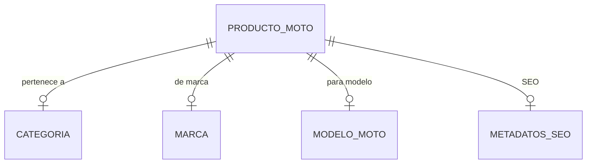
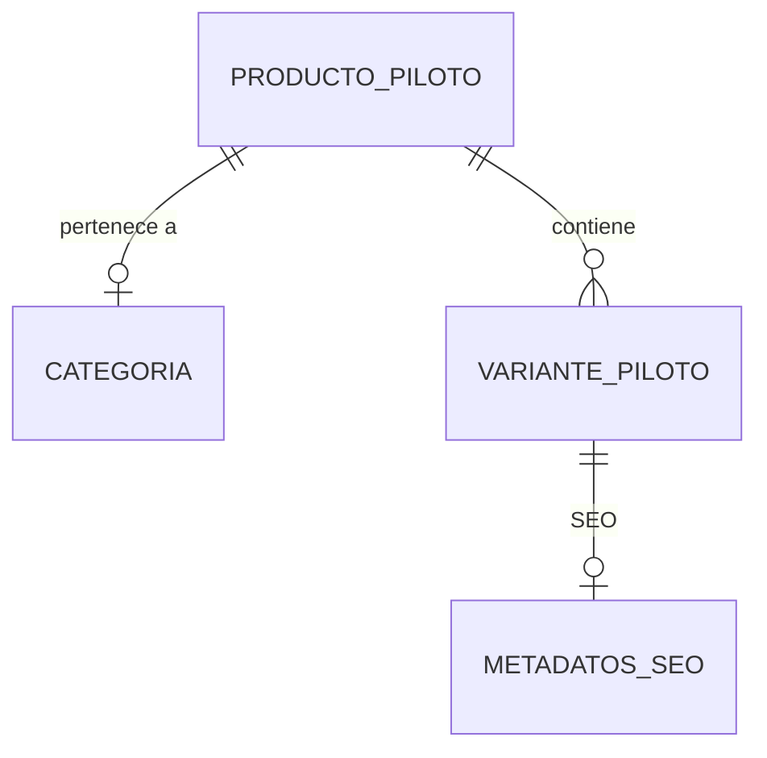

# Arquitectura de Datos y Esquemas (Zomos Motos)

Este documento detalla la estructura de la base de datos de Strapi, con dos catálogos independientes: productos para motos y productos para pilotos. Todos los campos enumerados están protegidos con ENUMs para garantizar integridad de datos.

## 🗺️ Diagrama de Relaciones (ERD)

### Productos para Motos


### Productos para Pilotos


---

## 📦 Colecciones Principales

### 1. Producto para Moto (`producto-moto`)
Accesorios y repuestos para motocicletas específicas.
- **`nombre`**: Texto corto (requerido).
- **`slug`**: UID (basado en `nombre`, único).
- **`precio`**: Decimal (requerido).
- **`descripcion`**: Texto enriquecido (Rich Text).
- **`referencia`**: Texto corto (único, SKU).
- **`imagenes`**: Media (Múltiple).
- **`categoria`**: Relación M:1 con `categoria` (requerido).
- **`marca_moto`**: Relación M:1 con `marca` (requerido) - ej: Yamaha, Honda, Bajaj.
- **`modelo_moto`**: Relación M:1 con `modelo-moto` (requerido) - ej: MT-09, CB500F.
- **`metadatos_seo`**: Componente (`compartido.metadatos-seo`).

### 2. Producto para Piloto (`producto-piloto`)
Equipo de protección y accesorios para motociclistas.
- **`nombre`**: Texto corto (requerido).
- **`slug`**: UID (basado en `nombre`, único).
- **`precio`**: Decimal (requerido).
- **`descripcion`**: Texto enriquecido (Rich Text).
- **`referencia`**: Texto corto (único, SKU).
- **`imagenes`**: Media (Múltiple).
- **`categoria`**: Relación M:1 con `categoria` (requerido).
- **`marca_generico`**: Boolean (¿es marca genérica?).
- **`variantes_piloto`**: Componente repetible (`tienda.variante-piloto`).
- **`metadatos_seo`**: Componente (`compartido.metadatos-seo`).

### 3. Categoría (`categoria`)
Clasificación lógica de los productos.
- **`nombre`**: Texto corto (requerido, único).
- **`slug`**: UID (basado en `nombre`, único).
- **`tipo`**: ENUM (`MOTO`, `PILOTO`) - requerido.
- **`descripcion`**: Texto largo (opcional).

### 4. Marca (`marca`)
Fabricantes de motocicletas (ej: Yamaha, Honda, Bajaj).
- **`nombre`**: Texto corto (requerido, único).
- **`slug`**: UID (basado en `nombre`, único).
- **`logo`**: Media (Imagen única, opcional).
- **`modelos`**: Relación 1:M con `modelo-moto`.

### 5. Modelo de Moto (`modelo-moto`)
Referencias específicas de motocicletas.
- **`nombre`**: Texto corto (requerido) - ej: MT-09, CB500F.
- **`slug`**: UID (basado en `nombre`).
- **`marca`**: Relación M:1 con `marca` (requerido).

---

## 🧩 Componentes

### Variante de Piloto (`tienda.variante-piloto`)
Estructura de tallas, colores y marcas para productos de equipo (PILOTO).
- **`talla`**: ENUM (`XS`, `S`, `M`, `L`, `XL`, `XXL`, `UNICA`) - requerido.
- **`color`**: Texto corto (requerido) - ej: Negro, Rojo, Azul.
- **`marca_piloto`**: ENUM - requerido. Valores permitidos:
  - `ALPINESTARS`
  - `BELL`
  - `FOX`
  - `SHOEI`
  - `ARAI`
  - `LAZER`
  - `SIMPSON`
  - `PELTOR`
  - `SCOTT`
  - `LEATT`
  - `DAINESE`
  - `ONEAL`
  - `HJC`
  - `AGVPRO`
  - `NOLAN`
  - `SHARK`
  - `GENERICA`
- **`modificador_precio`**: Decimal (opcional, ± sobre precio base) - ej: 5.00, -2.50.
- **`cantidad_stock`**: Entero >= 0 (requerido) - cantidad disponible.

### Metadatos SEO (`compartido.metadatos-seo`)
Información para motores de búsqueda y redes sociales.
- **`titulo_meta`**: Texto corto (máx 60 caracteres, requerido).
- **`descripcion_meta`**: Texto largo (máx 160 caracteres, requerido).
- **`imagen_meta`**: Media (Imagen única, opcional).
- **`url_canonica_personalizada`**: Texto corto (opcional - URL canónica personalizada).

---

## 📋 ENUMs Globales (Protección de Datos)

### Tipo de Categoría
```
MOTO
PILOTO
```

### Tallas de Equipo (Ropa, Cascos, Accesorios)
```
XS
S
M
L
XL
XXL
UNICA
```

### Marcas de Equipo Piloto
```
ALPINESTARS
BELL
FOX
SHOEI
ARAI
LAZER
SIMPSON
PELTOR
SCOTT
LEATT
DAINESE
ONEAL
HJC
AGVPRO
NOLAN
SHARK
GENERICA
```

---

## 📝 Ejemplos de Datos

### Ejemplo: Producto Moto
```json
{
  "nombre": "Leva de Lujo",
  "slug": "leva-de-lujo",
  "precio": 45.99,
  "referencia": "LEVA-LUX-001",
  "categoria": { "id": 3, "nombre": "Repuestos" },
  "marca_moto": { "id": 1, "nombre": "Yamaha" },
  "modelo_moto": { "id": 1, "nombre": "MT-09" },
  "metadatos_seo": {
    "titulo_meta": "Leva de Lujo para Yamaha MT-09",
    "descripcion_meta": "Leva de calidad premium para Yamaha MT-09. Durabilidad garantizada."
  }
}
```

### Ejemplo: Producto Piloto
```json
{
  "nombre": "Casco Integral Bell Moto-9",
  "slug": "casco-bell-moto-9",
  "precio": 350.00,
  "referencia": "CASCO-BELL-001",
  "categoria": { "id": 5, "nombre": "Cascos" },
  "marca_generico": false,
  "variantes_piloto": [
    {
      "talla": "M",
      "color": "Negro",
      "marca_piloto": "BELL",
      "modificador_precio": 0,
      "cantidad_stock": 10
    },
    {
      "talla": "L",
      "color": "Rojo",
      "marca_piloto": "BELL",
      "modificador_precio": 5.00,
      "cantidad_stock": 7
    }
  ],
  "metadatos_seo": {
    "titulo_meta": "Casco Bell Moto-9 - Equipo de Protección",
    "descripcion_meta": "Casco integral Bell Moto-9 con protección de calidad profesional."
  }
}
```

---

## 🔒 Consideraciones de Integridad

- **ENUMs**: Todos los campos enumerados son estrictos en Strapi. Valores inválidos serán rechazados en API. Protege contra errores de tipografía y case-sensitive.
- **Unicidad**: `referencia` (SKU), `slug` y campos de nombre son únicos a nivel de BD.
- **Relaciones requeridas**: En productos, categoria es siempre obligatoria. En motos, marca y modelo también.
- **Stock**: En pilotos, `cantidad_stock` debe ser >= 0. Usar este campo en lugar de booleanos.
- **Separación de catálogos**: Los productos de moto NO tienen variantes. Los de piloto SÍ tienen variantes (talla, color, marca).
- **Marca genérica**: Solo aplica a productos piloto. Indicador boolean de si es una marca genérica o de marca registrada.
